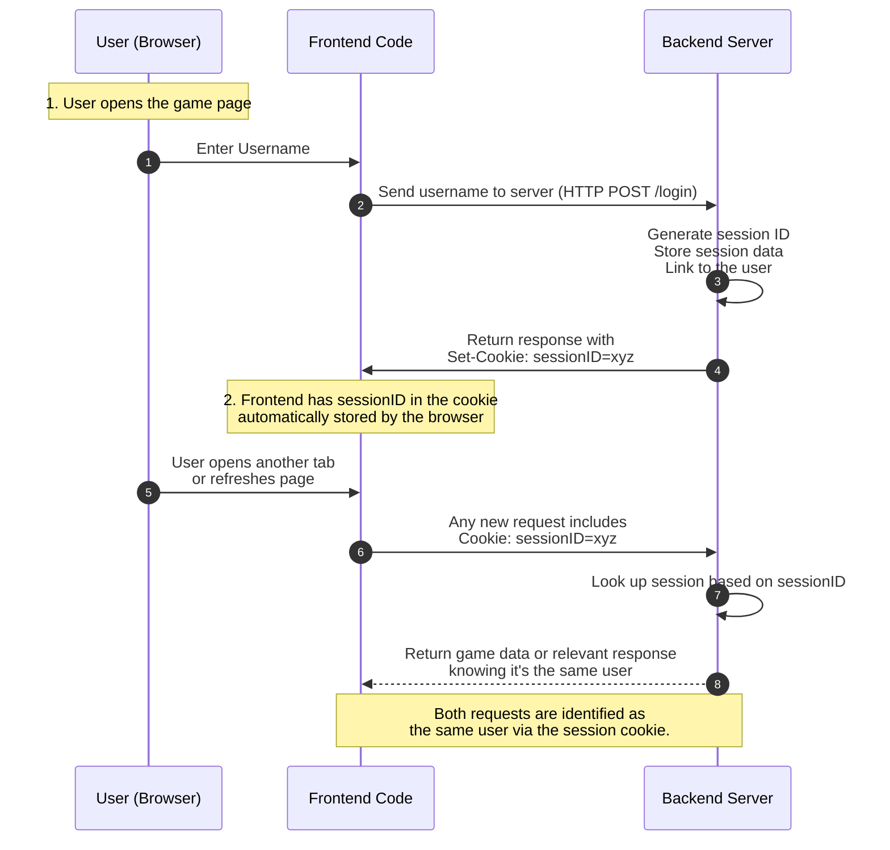

# Player management

Typical Approach:

When the player logs in (submits a username), generate a unique session ID on the server.
Send that session ID back to the client as a cookie.
On each request (or socket connection) from the browser, check the cookie to identify the same session.
How it helps:

If the user opens a new tab in the same browser, the session cookie is automatically sent along with each request. This allows the server to identify the same player regardless of how many tabs are open.

